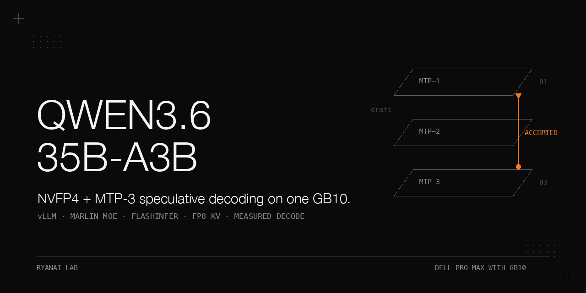

> **Status (2026-09-20): historical.** The model line has moved on. For current single-node numbers on this hardware see `dell-pro-max-gb10-qwen3.8-27b` and `dell-pro-max-gb10-qwen3.8-27b-mtp-k-sweep`; for the two-node production engine see `dell-pro-max-gb10-qwen3.8-flash-next-1m-context`. The measurements below are kept as a record of the method and of what this model did at the time.

# Qwen3.6-35B-A3B NVFP4 on one Dell Pro Max with GB10 — MTP-3 speculative decoding, marlin MoE backend, flashinfer, fp8 KV

> A measured test of whether NVFP4-quantized Qwen3.6-35B-A3B, served on a single Dell Pro Max with GB10 (Grace CPU, aarch64) with the community MTP-3 speculative-decoding recipe plus a marlin MoE backend, flashinfer attention and fp8 KV cache, could turn a bandwidth-bound single-node box into a usable code decoder. The nvidia-official NVFP4 weights with MTP-3 raised code decode decisively over the no-MTP code baseline (+44.9% to +50.6%, 113.6 / 118.1 vs 78.4 tok/s, single stream); the MTP mean acceptance length stayed healthy at 2.51. Unsloth Fast quantization was a dead end for this machine, and a dense 27B NVFP4 model decoded at about 20 tok/s single stream in our runs, which is why the A3B MoE was locked in. This recipe served as our single-node workhorse from mid-July to mid-August 2026 before we moved to Qwen3.8-27B. A pre-deployment prediction (~103 tok/s from the community MTP-3 recipe) sits next to our measured code throughput and is reported both ways in the Results section.

## Why this matters

A single Dell Pro Max with GB10 is a bandwidth-bound box: a dense 27B NVFP4 model decodes at about 20 tok/s single stream on this hardware in our runs, which is not a usable code-decoding rate. The interesting question is whether an NVFP4-quantized A3B mixture-of-experts model, combined with multi-token-prediction (MTP-3) speculative decoding, can cross that rate without losing answer quality. This cookbook records what worked, what silently did not, and the failure modes that are easy to mistake for model regressions. The headline is the measured code-decode lift on this single node, while the two obvious shortcuts (unsloth Fast quantization, and a square-resize ChartQA baseline) are traps.

## Hardware and stack

| Item | Exact value |
|---|---|
| Machine | single Dell Pro Max with GB10 (Grace CPU, aarch64) |
| Serving image | `vllm/vllm-openai:v0.24.0-aarch64-ubuntu2404` (in-container torch 2.11.0+cu130) |
| Weights | `/models/Qwen3.6-35B-A3B-NVFP4`, nvidia-official NVFP4 build |
| Recipe | community MTP-3 + marlin MoE backend + flashinfer + fp8 KV cache |
| Env | `VLLM_MARLIN_USE_ATOMIC_ADD=1` |
| Flags | `--gpu-memory-utilization 0.40`, `--memory=55g` (host-RAM hard cap), `--max-num-batched-tokens 4096` |
| aarch64 note | vLLM publishes a separate `-aarch64-` suffixed tag for Grace/arm64 machines; using the default x86_64 tag breaks various submodule imports because the Triton/PTXAS compile path is wrong |

The deployment is a single node — one Dell Pro Max with GB10. All numbers below were measured on that one node.

## How to reproduce

1. Reject the unsloth Fast NVFP4 quant path for this hardware (negative result, see "What did not work"); lock the model size on 35B-A3B after the dense 27B decode rate.
2. Pull the vLLM image with the explicit aarch64 tag (`vllm/vllm-openai:v0.24.0-aarch64-ubuntu2404`) — never the default x86_64 tag.
3. Launch the serving container on the GB10 node with the nvidia-official Qwen3.6-35B-A3B-NVFP4 weights, MTP-3 speculative decoding, the marlin MoE backend, flashinfer and fp8 KV, the env var `VLLM_MARLIN_USE_ATOMIC_ADD=1`, and the flags `--gpu-memory-utilization 0.40`, `--memory=55g`, `--max-num-batched-tokens 4096`. The full launch command as recorded in the source is the combination of the image, weights path, recipe, env var and flags above; the exact single-line invocation is **not recorded** beyond these components — do not reconstruct one.
4. If MTP launch raises an `AssertionError`, pin `--max-num-batched-tokens` to 4096; the root cause is in "Pitfalls".
5. Measure decode throughput on code; record MTP acceptance lengths, the KV-cache pool size and container host-RAM usage.
6. Run the ChartQA quality gate: 40 questions, API path, same seed (123), relaxed judging — on the base model and with the chart-QA vision LoRA adapter loaded through vLLM multi-LoRA. The adapter's language-side modules applied; its vision-tower modules were ignored by vLLM at that version (logged as "no matching PunicaWrapper"), so the 90.0% reflects the language-side adapter only.

> Prerequisite notes: the exact `docker run` / `vllm serve` single-line launch command is not recorded in the source beyond the components listed in the table and step 3; do not guess one.

## Results

All numbers below are copied verbatim from the source; each carries its measurement condition. Full tables with conditions are in `docs/results.md`.

### Decode throughput

| Workload | Value(s) | Condition |
|---|---|---|
| Code decode, MTP-3 recipe | **113.6 / 118.1 tok/s** | single node; two recorded values (median-vs-low labeling not stated in source); our measurements |
| Code decode, no-MTP baseline | **78.4 tok/s** | baseline against the two values above; improvement **+44.9% to +50.6%** (113.6 / 118.1 vs 78.4 tok/s, single stream) |
| Code decode (pre-deployment prediction) | **~103 tok/s** | a pre-deployment prediction from the community MTP-3 recipe; the 113.6 / 118.1 above are our measurements |

**Prediction vs measurement, stated openly:** the pre-deployment prediction from the community MTP-3 recipe was ~103 tok/s, while our deployment measurements were 113.6 / 118.1 tok/s. The prediction is a community-recipe forecast, not one of our measured values; we report both and do not reconcile them.

### MTP acceptance (prose condition)

| Metric | Value |
|---|---|
| Mean acceptance length | **2.51** |
| Per-position acceptance (draft tokens 1/2/3) | **0.74 / 0.47 / 0.29** |

Acceptance length 2.51 = 1 + 0.74 + 0.47 + 0.29 rounded; the per-position rates are per-position acceptance rates on prose prompts.

### Memory / KV pool

| Item | Value | Condition |
|---|---|---|
| KV cache pool | **22.46 GiB = 1,054,918 tokens** | fp8 KV, flags per the stack table |
| Container host RAM | **7.2G** used against the hard cap | launch flag `--memory=55g` is a host-RAM hard cap in gigabytes; 7.2G here is the measured usage, a different quantity from the pool size (GiB) |
| GPU-memory utilization flag | **0.40** | launch flag |

### ChartQA quality gate

| Model variant | Score | Condition |
|---|---|---|
| Base NVFP4 @ vLLM | **87.5%** | 40 questions, seed 123, relaxed judging, API path |
| + chart-QA vision LoRA adapter (multi-LoRA) | **90.0%** | same gate; delta **+2.5**, a net one question (36/40 vs 35/40); no repeated measurement to confirm a stable lift. The adapter was loaded through vLLM multi-LoRA; its language-side modules applied, its vision-tower modules were ignored by vLLM at that version (logged as "no matching PunicaWrapper"), so the 90.0% reflects the language-side adapter only |
| Trap comparison: base @ transformers, 768×768 squash | **66.67%** | the 66.67% figure comes from a different item count that was not recorded, so it is kept out of the 40-question comparison. The two evaluation conventions differ in serving stack and image preprocessing (forced square resize vs aspect-ratio-preserving); we did not isolate the resize alone |

## What did not work

| Attempt | Result |
|---|---|
| unsloth Fast NVFP4 quantization on this machine | **no increment over the nvidia-official NVFP4 build**. Community reports on this hardware: NVIDIA's official NVFP4 checkpoint 103.4 tok/s vs the unsloth NVFP4 checkpoint 87.6 tok/s (about −15%). This is unrelated to the 2.5× figure quoted for B200 — the marketing number does not transfer to GB10 |
| 27B dense model on one GB10 | a dense 27B NVFP4 model decodes at about **20 tok/s** single stream on this hardware in our runs; this is why the 35B-A3B MoE was locked in |
| MTP with `max_num_batched_tokens` left at 2048 | with MTP enabled the engine lowered `max_num_batched_tokens` to 2048, which is below the 2144-token attention block that the hybrid-mamba alignment needs, so the engine asserted at start-up; setting `--max-num-batched-tokens 4096` fixes it (root cause in "Pitfalls") |
| x86_64 vLLM image tag on the aarch64 host | submodule import failures via wrong Triton/PTXAS compile path |
| transformers-side 768×768-squash eval as a quality baseline | produced 66.67%; the item count for that run was not recorded, and the two evaluation conventions differ in serving stack and image preprocessing — we did not isolate the resize alone, so it is not a model-quality signal |
| Checkpoint-saving during GB10 training runs | epoch-boundary save spikes caused global OOM — three recorded deaths, all at epoch boundaries; `save_strategy=no` avoids the checkpoint-time memory spike (final weights are exported once at the end; no mid-run resume) |
| Serving inference through `PeftModel` (unmerged LoRA) on the base model | inference **20× slower** in our runs (4 min vs 12 s per item); for evaluation, run the merged model. multi-LoRA serving in vLLM is a separate path |
| `unsloth save_pretrained` as an archive | in our unsloth run, `save_pretrained` wrote only the config; the merged weights were in the merge output directory |

## Pitfalls

Symptom → root cause → fix. Expanded with "how we found it" in `docs/pitfalls.md`.

- **AssertionError at MTP launch** → with MTP enabled the engine lowered `max_num_batched_tokens` to 2048, which is below the 2144-token attention block that the hybrid-mamba alignment needs, so the engine asserted at start-up → set `--max-num-batched-tokens 4096`.
- **Switch script's resident process returns "fetch failed" against a restarted backend** → stale connection → restart the switch script.
- **`scp` of adapters out of the training container → root-owned files, "Permission denied"** → `chown` the files first (the exact UID/GID for the serving user was not recorded).
- **Short-`max_tokens` requests return empty `content`** → qwen thinking is on by default and eats the budget → force `enable_thinking=False`, the `chat_template_kwargs` field on the request (also the first acceptance check in every inference script; thinking leakage was found at 7 sites).
- **Vision-tower LoRA appears to do nothing** → vLLM silently ignores `visual.blocks.*` ("no matching PunicaWrapper"); the language-side modules applied, the vision-tower modules were ignored by vLLM at that version → keep visual-tower deltas out of vLLM-served LoRA expectations; the 90.0% reflects the language-side adapter only.
- **Host OOM / memory starvation** → another resident service on the host was over-allocating memory; capping its context and parallelism freed about 57 GB.
- **vLLM won't import on the GB10** → wrong-arch image tag (x86_64 on aarch64) → always use the `-aarch64-` suffixed tag.
- **`--memory` set at the machine's full RAM** → other resident services on the host have no headroom and the box OOMs → leave host margin; here a hard cap below total RAM (55g).
- **Serving via `PeftModel` on the base model** → 20× latency penalty in our runs (4 min vs 12 s per item) → for evaluation, run the merged model; multi-LoRA serving in vLLM is a separate path.
- **Benchmark "regression" after switching serving stacks** → the two evaluation conventions differ in serving stack and image preprocessing; we did not isolate the resize alone → compare only under identical preprocessing.

## Files

- `README.md` — this cookbook.
- `docs/results.md` — all result tables, complete, with a one-line note of the measurement conditions above each table.
- `docs/pitfalls.md` — the pitfalls expanded (symptom / root cause / fix / how we found it).
- `docs/make_banner.py` — pure-PIL banner generator; writes `docs/assets/banner.png`. House style, no generated imagery.

## License

Apache-2.0.
